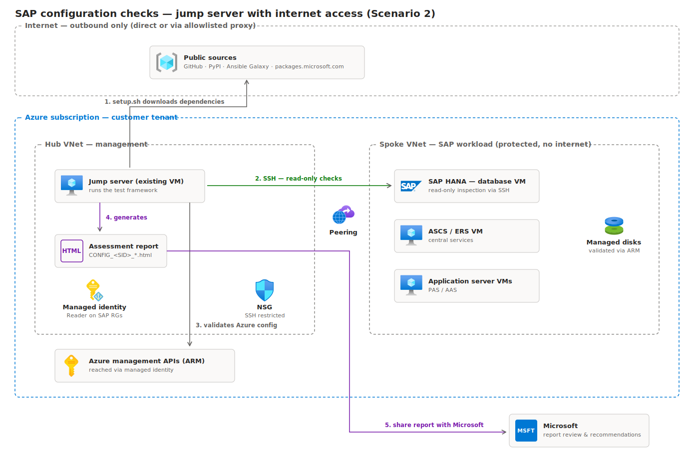
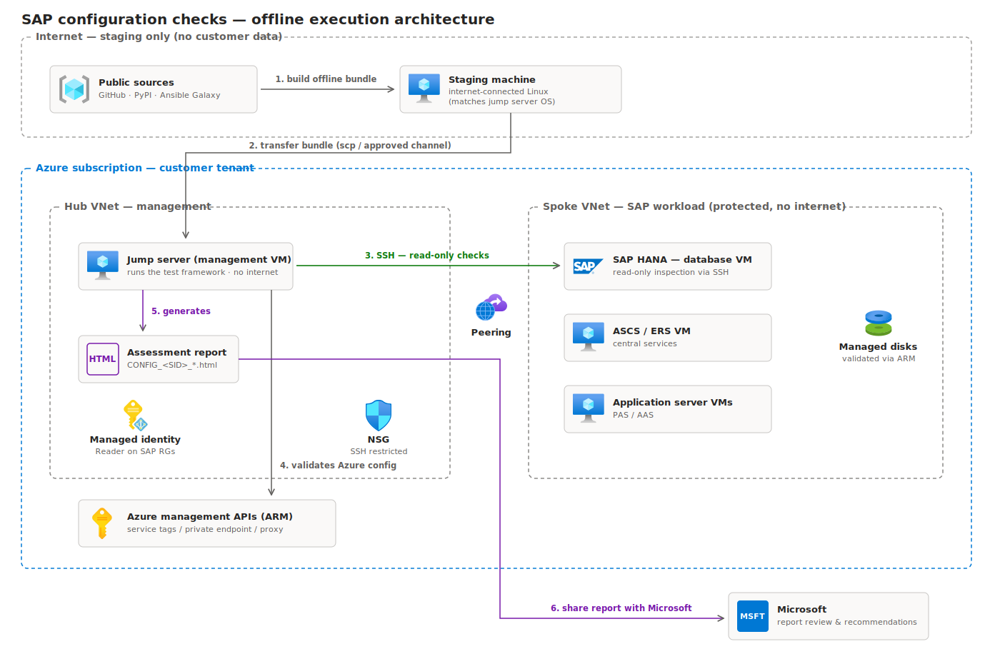

# Quickstart — running the SAP configuration checks

## Background — why this documentation exists

Your SAP landscape runs on Azure inside a protected network. Before relying on it in
production, Microsoft provides a free validation tool — the
[SAP Testing Automation Framework](https://github.com/Azure/sap-automation-qa) — that
inspects the deployment (VM configuration, storage, network, SAP/HANA parameters,
cluster settings) and produces an HTML assessment report you can review with Microsoft
to receive recommendations.

The framework was designed assuming open internet access, which secure SAP
environments don't have. This repository closes that gap: it documents exactly how to
install and run the checks from a **jump (management) server** inside your network,
covers both connectivity situations you may be in, and includes fixes for issues we
found and resolved while validating the entire procedure end to end in a lab replica
of this topology (hub/spoke, Azure Landing Zone policies, SLES SAP nodes) on
2026-07-13 — culminating in a successfully generated report.

Two principles worth stating up front:

- **Nothing is ever installed on the SAP servers.** The framework connects to them
  over SSH in read-only fashion. All software lives on the jump server.
- The jump server needs to reach Azure management APIs (`management.azure.com`) via
  its managed identity for the infrastructure checks — private connectivity or proxy
  is sufficient.

## Which scenario are you in?

Run this on the jump server:

```bash
curl -sI --max-time 10 https://pypi.org >/dev/null && echo "SCENARIO 2 (online)" || echo "SCENARIO 1 (offline)"
```

| | **Scenario 2 — jump server with internet/proxy** | Scenario 1 — fully air-gapped |
|---|---|---|
| Jump server reaches PyPI/GitHub | Yes (directly or via allowlisted proxy) | No |
| Extra "staging" machine needed | No | **Yes** |
| Effort | ~10 commands, 1 machine | ~25 commands, 2 machines |

**Scenario 2 is the primary path of this guide** (it matches this environment).
Scenario 1 is retained as the fallback at the end, in case connectivity is ever
restricted further.

---

# Scenario 2 — existing jump server with internet access

**The scenario:** you already have a jump server VM inside the Azure network, with a
route to the SAP VMs and outbound internet access (direct or through an allowlisted
proxy). Everything happens on this one machine: it downloads the framework and its
dependencies, connects to the SAP servers over SSH to read their configuration,
queries Azure resource settings through its managed identity, and generates the
report. No staging machine, no offline bundle.



The numbered flow: (1) the jump server installs the framework and dependencies
directly from public sources; (2) it inspects the SAP VMs via SSH — read-only;
(3) it validates Azure resource configuration through ARM using its managed identity;
(4) it generates the HTML assessment report; (5) the report is shared with Microsoft.

If a proxy is in the path, it must allow: `github.com`, `pypi.org`,
`files.pythonhosted.org`, `galaxy.ansible.com`, `aka.ms`, `packages.microsoft.com`,
`management.azure.com`.

## Step-by-step

Every step is tagged with **where it runs**. In Scenario 2 there are only two places:
🖥️ your **workstation** (any machine with Azure CLI — laptop, Cloud Shell) for the
one-time Azure setup, and ☁️ the **jump server** (SSH into it first) for everything else.

### Step 1 — One-time prerequisites

> 🖥️ **Run on: your WORKSTATION** (any machine with Azure CLI logged into the subscription — or Azure Cloud Shell).

The framework reads your Azure resource settings (VMs, disks, load balancers,
network) using a **managed identity** — an identity that belongs to the jump server
VM itself, so no passwords or keys are involved. Setting it up is two commands, and
**the first command produces the ID that the second command needs.**

**Command 1 — enable the identity on the jump server VM.**
⚠️ REPLACE `<JUMP_RG>` and `<JUMP_VM>` with the jump server's resource group and VM name:

```bash
az vm identity assign -g <JUMP_RG> -n <JUMP_VM>
```

Expected output — note the `principalId`, that's the value you'll use next:

```json
{
  "systemAssignedIdentity": "d4f8a1b2-3c5e-4f6a-9b7c-1234567890ab",
  ...
}
```

(The `systemAssignedIdentity` GUID **is** the principal ID. If you need to look it up
again later: `az vm show -g <JUMP_RG> -n <JUMP_VM> --query identity.principalId -o tsv`)

**Command 2 — grant that identity read access to the SAP resources.**
⚠️ REPLACE `<PRINCIPAL_ID>` with the GUID from command 1, and `<SUB_ID>`/`<SAP_RG>`
with the subscription and resource group where the SAP resources live:

```bash
az role assignment create --assignee <PRINCIPAL_ID> --role Reader \
  --scope /subscriptions/<SUB_ID>/resourceGroups/<SAP_RG>
```

Repeat command 2 once per resource group if your SAP components (VMs, disks, load
balancers, shared storage) are spread across several. **Reader** = view-only: the
identity can inspect configurations but can never change anything.

Tip — do both in one shot, letting the shell carry the ID over:

```bash
PRINCIPAL_ID=$(az vm identity assign -g <JUMP_RG> -n <JUMP_VM> --query systemAssignedIdentity -o tsv)
az role assignment create --assignee "$PRINCIPAL_ID" --role Reader \
  --scope /subscriptions/<SUB_ID>/resourceGroups/<SAP_RG>
```

Also confirm SSH (Linux) or WinRM (Windows) works from the jump server to every SAP VM.

### Step 2 — Install the framework

> ☁️ **Run on: JUMP SERVER.** Connect first: `ssh <user>@<jump-server-ip>`. Steps 2
> through 8 all run here.

```bash
# if behind a proxy, first: export http_proxy=... https_proxy=...
sudo apt-get install -y git     # yum/zypper per distro
git clone https://github.com/Azure/sap-automation-qa.git
cd sap-automation-qa
./scripts/setup.sh              # installs Azure CLI, Python venv, Ansible collections (~5-10 min)
source .venv/bin/activate
```

### Step 3 — Apply the validated fixes (required — see LAB-FINDINGS.md)

> ☁️ **Run on: JUMP SERVER.**

Without these, every Linux run fails with an error hidden behind `no_log`:

```bash
# from a clone of this repo (or download the script raw from GitHub):
./apply-framework-fixes.sh ~/sap-automation-qa
```

### Step 4 — Check Python on the SAP servers

> ☁️ **Run on: JUMP SERVER.** The `ssh` commands below are executed *from* the jump
> server, reaching *into* each SAP VM — you never log in to the SAP VMs directly
> from your workstation.

The framework requires Python ≥ 3.7 **on the SAP VMs**. SLES 15 / RHEL 8 default to
3.6. First, just check — recent Azure images often already include a newer
interpreter side by side (our lab's SLES 15 SP5 image shipped `python3.11` out of
the box):

```bash
ssh <user>@<sap-vm> 'ls /usr/bin/python3*'
```

If a 3.7+ interpreter is listed, nothing to install — you'll simply reference it in
`hosts.yaml` (Step 5). If not, install one. Note that the SAP VMs having "no
internet" does **not** block this: SLES/RHEL pay-as-you-go VMs on Azure receive
packages from the distro's Azure-internal update infrastructure (SUSE Public Cloud
Update Infrastructure / RHUI) — the same private channel that delivers their security
patches:

```bash
ssh <user>@<sap-vm> 'sudo zypper install -y python311'    # SLES
ssh <user>@<sap-vm> 'sudo dnf install -y python3.11'      # RHEL
```

The install is harmless to SAP: it adds a parallel interpreter and changes no system
default. Only if even the update infrastructure is blocked (rare), transfer the RPMs
through the jump server and install with `rpm -ivh` — same offline pattern as
Scenario 1.

### Step 5 — Describe the SAP system (workspace)

> ☁️ **Run on: JUMP SERVER**, inside the `sap-automation-qa` folder cloned in Step 2.

The framework doesn't discover anything by itself — you describe your SAP system in a
"workspace" folder containing two files (plus credentials, section 5c). Everything
below is copy-paste ready: paste each block into the terminal as one piece, replacing
only the UPPERCASE placeholders.

> **What is a SID?** Every SAP system has a **System ID (SID)** — a unique
> 3-character uppercase code that identifies it, chosen when the system was
> installed (e.g. `PRD` for production, `QAS` for quality, or a custom one like
> `AMS`). The database has its own SID too (**DB SID** — for HANA often `HDB` or
> matching the system SID). You don't invent these values now: your SAP Basis team
> knows them, and they appear in the SAP GUI status screen and in directory names on
> the SAP servers (`/usr/sap/<SID>/`). The examples below use `AMS` as the SAP SID
> and `HDB` as the DB SID — replace them with yours.

First create the folder. The name is your choice; the convention is
`ENV-REGION-VNET-SID`, e.g. `PRD-EUS2-SAP01-AMS`:

```bash
mkdir -p WORKSPACES/SYSTEM/PRD-EUS2-SAP01-AMS
cd WORKSPACES/SYSTEM/PRD-EUS2-SAP01-AMS
```

#### 5a. `hosts.yaml` — which servers to check and how to reach them

One entry per SAP VM, grouped by role: `<SID>_DB` (database), `<SID>_SCS` (central
services), `<SID>_APP` (application servers). Example for SID `AMS` with one of each —
paste the whole block, then adjust IPs/names (add or remove host entries as needed):

```bash
cat > hosts.yaml <<'EOF'
AMS_DB:
  hosts:
    SAPDBHOSTNAME:                 # the VM's hostname
      ansible_host: "10.0.0.10"    # its private IP
      ansible_user: "azureadm"     # SSH user (must be able to sudo without password)
      ansible_connection: "ssh"
      connection_type: "key"
      virtual_host: "SAPDBHOSTNAME"
      become_user: "root"
      os_type: "linux"
      ansible_python_interpreter: "/usr/bin/python3.11"   # from Step 4
      vm_name: "AZURE-VM-NAME"     # exactly as shown in the Azure portal
  vars:
    node_tier: "hana"
AMS_SCS:
  hosts:
    SAPSCSHOSTNAME:
      ansible_host: "10.0.0.11"
      ansible_user: "azureadm"
      ansible_connection: "ssh"
      connection_type: "key"
      virtual_host: "SAPSCSHOSTNAME"
      become_user: "root"
      os_type: "linux"
      ansible_python_interpreter: "/usr/bin/python3.11"
      vm_name: "AZURE-VM-NAME"
  vars:
    node_tier: "scs"
AMS_APP:
  hosts:
    SAPAPPHOSTNAME:
      ansible_host: "10.0.0.12"
      ansible_user: "azureadm"
      ansible_connection: "ssh"
      connection_type: "key"
      virtual_host: "SAPAPPHOSTNAME"
      become_user: "root"
      os_type: "linux"
      ansible_python_interpreter: "/usr/bin/python3.11"
      vm_name: "AZURE-VM-NAME"
  vars:
    node_tier: "app"
EOF
```

(If your SID is not `AMS`, rename the three group headers accordingly — they must be
`<SID>_DB`, `<SID>_SCS`, `<SID>_APP` in uppercase.)

#### 5b. `sap-parameters.yaml` — what the SAP system looks like

```bash
cat > sap-parameters.yaml <<'EOF'
sap_sid: "AMS"                        # your SAP SID
db_sid: "HDB"                         # your database SID
platform: "HANA"                      # HANA / Db2 / ORACLE / SQLSERVER
scs_high_availability: false          # true if ASCS/ERS is clustered
database_high_availability: false     # true if DB uses HANA System Replication + cluster
database_scale_out: false
scs_instance_number: "00"
ers_instance_number: "01"
db_instance_number: "00"
NFS_provider: "AFS"                   # AFS (Azure Files) or ANF (Azure NetApp Files)
user_assigned_identity_client_id: ""  # empty = system-assigned identity (Step 1)
EOF
```

If HA is `true`, also add `scs_cluster_type`/`database_cluster_type` (`AFA`, `ISCSI`
or `ASD`) — see the upstream
[SETUP guide, section 2.2](https://github.com/Azure/sap-automation-qa/blob/main/docs/SETUP.MD#22-system-configuration-workspaces).

#### 5c. Credentials — how the jump server logs into the SAP VMs

Two supported options:

**Option A — Azure Key Vault (recommended, no key file on disk).** If the SSH private
key (or VM password) is already stored as a Key Vault secret, no credential file is
needed: grant the jump server's managed identity the *Key Vault Secrets User* role on
the vault, and add these two lines to `sap-parameters.yaml`:

```yaml
key_vault_id: /subscriptions/<SUB>/resourceGroups/<RG>/providers/Microsoft.KeyVault/vaults/<VAULT-NAME>
secret_id: https://<VAULT-NAME>.vault.azure.net/secrets/<SECRET-NAME>/<VERSION>
```

This is usually the easiest option to get approved by a security team — the key never
sits on the filesystem and access is audited by Key Vault.

**Option B — local key file.** Place the private key that the SAP VMs accept in the
workspace, named exactly `ssh_key.ppk`, readable only by you:

```bash
cp /path/to/your/private-key ssh_key.ppk
chmod 600 ssh_key.ppk
```

Context for the security discussion: the jump server is already the controlled
administrative host where operators SSH to the SAP VMs from — this key (or an
equivalent one) already lives in that trust zone. But if there's any hesitation,
use Option A.

Done — return to the framework root before continuing:

```bash
cd ../../..
```

### Step 6 — Configure and authenticate

> ☁️ **Run on: JUMP SERVER**, inside the `sap-automation-qa` folder (the managed
> identity only exists on this VM — these logins fail anywhere else).

This step has two parts: **(6a)** tell the framework what to run and against which
system, and **(6b)** authenticate to Azure.

#### 6a. Edit `vars.yaml` — 2 lines

`vars.yaml` already exists in the framework folder — you don't create it, you change
exactly **two lines** and leave everything else untouched:

| Line | Set it to | Why |
|---|---|---|
| `TEST_TYPE:` | `"ConfigurationChecks"` | fixed value — selects the configuration checks (not the HA functional tests) |
| `SYSTEM_CONFIG_NAME:` | `"PRD-EUS2-SAP01-AMS"` ⚠️ **REPLACE** with the exact folder name you created in Step 5 | tells the framework which workspace to use |

The command below does both — **before running it, replace `PRD-EUS2-SAP01-AMS`**
with your workspace folder name (it must match Step 5 exactly, including uppercase):

```bash
sed -i 's/^TEST_TYPE:.*/TEST_TYPE: "ConfigurationChecks"/; s/^SYSTEM_CONFIG_NAME:.*/SYSTEM_CONFIG_NAME: "PRD-EUS2-SAP01-AMS"/' vars.yaml
```

Verify it worked — this must print your two lines:

```bash
grep -E '^(TEST_TYPE|SYSTEM_CONFIG_NAME)' vars.yaml
```

Expected output:

```text
TEST_TYPE: "ConfigurationChecks"
SYSTEM_CONFIG_NAME: "PRD-EUS2-SAP01-AMS"
```

(Prefer an editor? `nano vars.yaml`, change the same two lines, Ctrl+O + Enter to
save, Ctrl+X to exit.)

#### 6b. Log in to Azure — twice

⚠️ **REPLACE `<SAP_SUB_ID>`** in both lines with the subscription ID that contains
your SAP resources (find it with `az account list -o table`, or in the Azure portal
under Subscriptions). Nothing else in these commands changes:

```bash
az login --identity && az account set --subscription <SAP_SUB_ID>
sudo az login --identity && sudo az account set --subscription <SAP_SUB_ID>
```

Why twice? `az login --identity` authenticates using the VM's managed identity from
Step 1 — no password involved. But Azure CLI sessions are stored per Linux user, and
the framework's Azure checks run as **root** — so root needs its own login (validated
finding, see LAB-FINDINGS.md issue 4). Skipping the `sudo` line doesn't stop the run,
but every Azure infrastructure check in the report will show
"Please run 'az login'" instead of results.

### Step 7 — Run

> ☁️ **Run on: JUMP SERVER**, inside `sap-automation-qa`, with the venv active
> (`source .venv/bin/activate` — prompt shows `(.venv)`).

The normal case is one command, no parameters — it runs **all** check families
(VM, storage, network, database, central services, application servers) against
every host in your `hosts.yaml`:

```bash
./scripts/sap_automation_qa.sh
```

The run takes several minutes (it SSHes into each SAP VM and queries Azure). It's
read-only — nothing on the SAP systems is changed.

**Optional: limiting the scope with `--extra-vars`.** By default the script reads its
settings from `vars.yaml` (Step 6). `--extra-vars` is a way to pass an extra setting
just for one run, without editing any file. The only setting worth passing here is
`configuration_test_type`, which restricts the run to a single check family — useful
to re-check one area quickly after a fix, or to shorten a first validation:

```bash
# only database checks (HANA/Db2):
./scripts/sap_automation_qa.sh --extra-vars='{"configuration_test_type":"Database"}'

# only ASCS/ERS (central services) checks:
./scripts/sap_automation_qa.sh --extra-vars='{"configuration_test_type":"CentralServiceInstances"}'

# only application server checks:
./scripts/sap_automation_qa.sh --extra-vars='{"configuration_test_type":"ApplicationInstances"}'
```

Accepted values: `all` (default), `Database`, `CentralServiceInstances`,
`ApplicationInstances`, `WebDispatcherInstances`. For the assessment report you share
with Microsoft, run without parameters (= `all`).

### Step 8 — Collect the deliverable

> ☁️ Report is generated on the **JUMP SERVER**; copy it to your 🖥️ **workstation**
> to open it.

```text
WORKSPACES/SYSTEM/<NAME>/quality_assurance/CONFIG_<SID>_<DB>_<INVOCATION_ID>.html
```

```bash
# from your workstation:
scp <user>@<jump-server-ip>:"~/sap-automation-qa/WORKSPACES/SYSTEM/<NAME>/quality_assurance/CONFIG_*.html" .
```

Open in a browser; share with Microsoft for review and recommendations.

---

# Scenario 1 — air-gapped jump server (fallback)

**The scenario:** the jump server cannot reach any public endpoint. A disposable
internet-connected Linux machine ("staging") — which must match the jump server's OS
distribution/version and Python version — builds a dependency bundle that is
transferred once.



Condensed procedure (full detail with per-step explanations in the
[offline installation guide](./sap-automation-qa-offline-install.md)):

### 💻 Run on: STAGING machine (internet-connected)

```bash
mkdir -p ~/sapqa-offline && cd ~/sapqa-offline
git clone https://github.com/Azure/sap-automation-qa.git
tar czf sap-automation-qa.tar.gz sap-automation-qa
python3 -m pip download -r sap-automation-qa/requirements.in -d wheels/
python3 -m pip install ansible-core
ansible-galaxy collection download -r sap-automation-qa/collections/requirements.yml -p collections_offline/
sudo dnf download --resolve --destdir=azcli_rpms/ azure-cli        # apt/zypper per distro
sudo dnf download --resolve --destdir=os_rpms/ python3-pip sshpass
tar czf sapqa-offline-bundle.tar.gz sap-automation-qa.tar.gz wheels/ collections_offline/ azcli_rpms/ os_rpms/
sha256sum sapqa-offline-bundle.tar.gz
scp sapqa-offline-bundle.tar.gz <user>@<jump-server-ip>:~/
```

### ☁️ Run on: JUMP SERVER (offline install — do NOT run setup.sh)

```bash
sha256sum sapqa-offline-bundle.tar.gz            # compare with staging value
tar xzf sapqa-offline-bundle.tar.gz
sudo rpm -ivh os_rpms/*.rpm azcli_rpms/*.rpm     # dpkg -i / zypper in per distro
tar xzf sap-automation-qa.tar.gz && cd sap-automation-qa
python3 -m venv .venv && source .venv/bin/activate
pip install --no-index --find-links=../wheels --upgrade pip
pip install --no-index --find-links=../wheels -r requirements.in
mkdir -p .ansible/collections
ansible-galaxy collection install -r ../collections_offline/requirements.yml -p .ansible/collections
export ANSIBLE_COLLECTIONS_PATH="$PWD/.ansible/collections"
export ANSIBLE_HOST_KEY_CHECKING=False
export ANSIBLE_PYTHON_INTERPRETER=$(which python3)
```

Then continue from **Scenario 2, Step 3** (fixes, workspace, run, report) — those
steps are identical in both scenarios.
