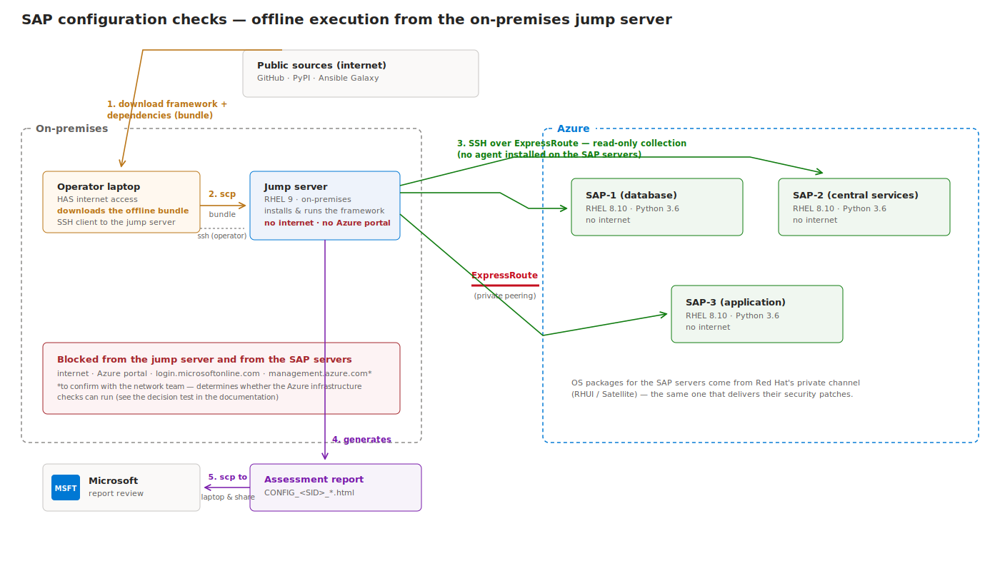

# Quickstart — SAP configuration checks in the offline environment

## Background — why this documentation exists

Your SAP landscape runs on Azure inside a protected network. Microsoft provides a
free validation tool — the
[SAP Testing Automation Framework](https://github.com/Azure/sap-automation-qa) — that
inspects the deployment (VM configuration, storage, network, SAP/HANA parameters,
cluster settings) and produces an HTML assessment report you review with Microsoft
to receive recommendations.

The framework was designed assuming open internet access, which this environment
doesn't have. This guide adapts it to the real topology: an **on-premises jump
server with no internet access**, connected to the SAP servers on Azure through
ExpressRoute. The procedure was validated end to end in a lab replica, including
fixes for real framework issues found during validation
([LAB-FINDINGS.md](./LAB-FINDINGS.md)).

## ❓ Does anything get installed on the SAP servers?

Answering this first because it's the most important question for any SAP owner:

- **No agent, no service, no framework component is installed on the SAP servers.**
  The framework runs entirely on the jump server and connects to each SAP server
  over SSH. During a check, Ansible (the engine underneath) temporarily copies small
  Python scripts to a temp directory on the server, executes them **read-only**,
  and removes them — standard agentless behavior, nothing persists.
- **The Python version, handled without touching the SAP servers (✅ lab-validated):**
  the SAP servers run Python 3.6 (RHEL 8.10 default), and the newest framework engine
  requires Python ≥ 3.7 on the machines it inspects. The fix lives **entirely on the
  jump server**: pin the engine to `ansible-core 2.16` (part of the bundle), which
  still supports Python 3.6 targets. In our lab replica (RHEL 8.10 + Python 3.6), the
  full checks ran with zero failures and generated the report — **nothing installed
  on the SAP servers.** This is the default this guide follows (Step 2 pins it).
  - *Fallback only if a future framework version drops 2.16 support:* install
    `python3.11` on each SAP server (additive RPM, no default change, no service
    restart, `sudo` required, DEV/QAS first). Not needed today.
- **Permissions for the checks themselves:** an SSH user on each SAP server able to
  `sudo` to root without password (used to read configurations only).

## The environment



| Component | Details |
|---|---|
| Jump server | **On-premises**, RHEL 9 — no internet, no Azure portal access. Installs and runs the framework. |
| Operator laptop | Has internet access; SSH client to the jump server. **Downloads the bundle** and transfers it. |
| Connectivity | On-premises ↔ Azure via **ExpressRoute** (private peering) |
| SAP servers | Azure VMs, RHEL 8.10, Python 3.6, no internet |

The flow: (1) the laptop downloads the framework and all dependencies (the
"bundle"); (2) the bundle is copied to the jump server via `scp`; (3) the jump
server runs the read-only checks against the SAP servers over ExpressRoute; (4) the
report is generated on the jump server; (5) copied back to the laptop and shared
with Microsoft.

> ⚠️ **To confirm with the customer:** this guide assumes the **operator laptop** is
> the internet-connected machine that downloads the bundle. If a different machine
> or file-transfer process is mandated (e.g. a controlled transfer area), only
> Steps 2–3 change — the origin of the files must then be documented here.

## ⚠️ One decision before starting: can the Azure checks run?

Part of the framework's value is validating **Azure resource configuration** (VM
SKUs, disks, load balancers). That requires the jump server to reach two public
endpoints. Test it:

> ☁️ **Run on: JUMP SERVER**

```bash
curl -sI --max-time 10 https://login.microsoftonline.com >/dev/null && echo AUTH-OK || echo AUTH-BLOCKED
curl -sI --max-time 10 https://management.azure.com >/dev/null && echo ARM-OK || echo ARM-BLOCKED
```

- **Blocked (expected here):** the run proceeds with **OS/SAP-level checks only**;
  Azure infrastructure checks appear as errors in the report. Step 4's fix script
  prepares the framework for this. If full coverage is wanted later, the network
  team can evaluate allowlisting those two endpoints via proxy.
- **Both OK:** you'll authenticate with a **service principal** in Step 7b and get
  the full report (a managed identity is not possible — the jump server is not an
  Azure VM).

## Where each step runs

Only three places exist in this procedure: 💻 the **operator laptop** (internet),
☁️ the **jump server** (no internet), and — via SSH from the jump server — the SAP
servers. Every step is tagged.

---

## Step 1 — Prerequisites on the jump server

> ☁️ **Run on: JUMP SERVER.**

The framework needs **Python 3.11, git, pip and sshpass** on the jump server (RHEL 9's
default is Python 3.9, too old to run the framework's engine; git is not installed by
default either — ✅ both confirmed in the lab). First check whether the jump server can
reach the Red Hat channel:

```bash
sudo dnf install -y python3.11 python3.11-pip git sshpass && python3.11 --version
```

- **If it succeeds** (3.11.x prints): done, go to Step 2.
- **If it times out / fails:** expected and common. ⚠️ **Lab-validated finding** — an
  on-premises jump server (and an Azure Landing Zone hub subnet) frequently has **no
  route to Red Hat's update servers (RHUI)**, so `dnf` cannot fetch anything. In that
  case the `python3.11` RPMs are **downloaded on the laptop and carried in the
  bundle** (Step 2 includes them) and installed offline in Step 4. Nothing more to do
  here — continue to Step 2.

Also confirm the jump server can SSH into every SAP server (it already can, per the
environment description).

## Step 2 — Download the bundle

> 💻 **Run on: OPERATOR LAPTOP** (the machine with internet). Commands assume a
> Linux/macOS shell; on Windows, use WSL (`wsl` in the Start menu) — same commands.

```bash
mkdir -p ~/sapqa-offline && cd ~/sapqa-offline

# 0. A local virtual environment for the download tooling. REQUIRED on modern
#    Ubuntu/Debian (Python 3.11+), where `pip install` into the system Python is
#    blocked with "externally-managed-environment" (PEP 668). The venv sidesteps
#    that cleanly (✅ found during a laptop dry-run). Needs python3-venv:
#      sudo apt-get install -y python3-venv     # Debian/Ubuntu, one time
python3 -m venv .buildenv
source .buildenv/bin/activate
pip install --upgrade pip

# 1. The framework + this documentation/fixes repo
git clone https://github.com/Azure/sap-automation-qa.git
git clone https://github.com/renatocamara/sap-automation-qa-offline.git tools
tar czf sap-automation-qa.tar.gz sap-automation-qa
tar czf tools.tar.gz tools

# 2. Python dependencies (~100 packages), targeting the jump server's platform:
#    Linux x86_64 + Python 3.11 — regardless of what the laptop runs.
#    The ansible-core<2.17 constraint is what lets the checks run against the SAP
#    servers' Python 3.6 WITHOUT installing anything on them (✅ lab-validated).
echo 'ansible-core<2.17' > constraints.txt
pip download -r sap-automation-qa/requirements.in -c constraints.txt -d wheels/ \
  --platform manylinux2014_x86_64 --python-version 3.11 --only-binary=:all:

# 3. Ansible collections (ansible-core goes into the .buildenv, not the system)
pip install ansible-core
ansible-galaxy collection download -r sap-automation-qa/collections/requirements.yml -p collections_offline/

# 4. python3.11 + git RPMs for the JUMP SERVER (only needed if Step 1's dnf failed —
#    i.e. the jump server can't reach Red Hat's RHUI; ✅ common in ALZ/on-prem).
#    Skip if Step 1 succeeded. Must be RHEL/EL 9 RPMs (matching the jump server),
#    downloaded on a RHEL 9 machine with a Red Hat subscription:
#      mkdir -p jump_rpms && dnf download --resolve --destdir=jump_rpms/ python3.11 python3.11-pip git sshpass
#    (If the laptop isn't RHEL 9, get them from the Red Hat customer portal or a
#    RHEL 9 VM; keep them in ./jump_rpms/ so they ride along in the bundle.)

# 5. Pack everything into ONE file and fingerprint it
tar czf sapqa-offline-bundle.tar.gz sap-automation-qa.tar.gz tools.tar.gz wheels/ collections_offline/ jump_rpms/ 2>/dev/null || \
tar czf sapqa-offline-bundle.tar.gz sap-automation-qa.tar.gz tools.tar.gz wheels/ collections_offline/
sha256sum sapqa-offline-bundle.tar.gz
```

Note the `sha256sum` value — you'll compare it after the transfer.

> If step 2's `pip download` fails on a specific package with "no matching
> distribution", run that same command inside WSL/Linux without the three
> `--platform/--python-version/--only-binary` flags.

## Step 3 — Transfer the bundle to the jump server

> 💻 **Run on: OPERATOR LAPTOP** (it sends the file **to** the jump server).

```bash
scp sapqa-offline-bundle.tar.gz <user>@<jump-server>:~/
```

## Step 4 — Install the framework on the jump server (offline)

> ☁️ **Run on: JUMP SERVER.**

Verify the transfer, unpack, and install — **do NOT run the framework's `setup.sh`**
(it requires internet); these commands replicate it offline:

```bash
sha256sum ~/sapqa-offline-bundle.tar.gz     # must match Step 2's value
cd ~ && tar xzf sapqa-offline-bundle.tar.gz

# If Step 1's dnf failed (jump can't reach RHUI), install python3.11 from the
# RPMs carried in the bundle — otherwise the next line (python3.11 -m venv) fails:
sudo rpm -Uvh jump_rpms/*.rpm 2>/dev/null || echo "no jump_rpms (python3.11 already present from Step 1)"

tar xzf sap-automation-qa.tar.gz && tar xzf tools.tar.gz
cd sap-automation-qa

python3.11 -m venv .venv && source .venv/bin/activate
pip install --no-index --find-links=../wheels --upgrade pip
pip install --no-index --find-links=../wheels -r requirements.in

mkdir -p .ansible/collections
# ansible-galaxy resolves the downloaded tarballs relative to the CURRENT directory,
# so install FROM the collections_offline folder (✅ offline dry-run finding —
# running it from here with a relative path fails with "Could not find *.tar.gz"):
COLL_DIR="$PWD/.ansible/collections"
( cd ../collections_offline && ansible-galaxy collection install -r requirements.yml -p "$COLL_DIR" )
export ANSIBLE_COLLECTIONS_PATH="$PWD/.ansible/collections"
export ANSIBLE_HOST_KEY_CHECKING=False
export ANSIBLE_PYTHON_INTERPRETER=$(which python3)
```

`--no-index` forbids pip from trying the internet; `--find-links` points it at the
transferred packages instead.

Then apply the validated framework fixes (required — without them every Linux run
fails, and offline runs abort at the Azure login; details in
[LAB-FINDINGS.md](./LAB-FINDINGS.md)):

```bash
# `bash` prefix avoids a "Permission denied" if the exec bit wasn't preserved
# through the download/transfer (✅ offline dry-run finding):
bash ../tools/apply-framework-fixes.sh .
```

## Step 5 — Python on the SAP servers — ⏭️ NORMALLY SKIP THIS

> ✅ **If you built the bundle with the `ansible-core<2.17` constraint (Step 2, the
> default), SKIP this step entirely and go to Step 6.** Lab-validated: with
> ansible-core 2.16 the checks run against the SAP servers' Python 3.6 as-is —
> **nothing is installed on the SAP servers.** This is the recommended path.

This step is the **fallback only**, needed if a future framework version drops
ansible-core 2.16 support (then Python ≥ 3.7 is required on the SAP servers).

<details><summary>Fallback: install python3.11 on each SAP server</summary>

> ☁️ **Run on: JUMP SERVER** — the `ssh` commands reach *into* each SAP server.

```bash
ssh <user>@<sap-server> 'ls /usr/bin/python3*'          # check what's there first
ssh <user>@<sap-server> 'sudo dnf install -y python3.11' # install if absent
```

Then add `ansible_python_interpreter: "/usr/bin/python3.11"` to each host in
`hosts.yaml` (Step 6). "No internet" does not block the install: the SAP servers
get packages from Red Hat's private channel (RHUI on Azure, or Satellite). If even
that is blocked, carry the RHEL 8 `python3.11` RPMs in the bundle and `sudo rpm
-ivh` them via the jump server. The install is additive — no default Python change,
no service restart, no SAP impact; DEV/QAS first.

</details>

## Step 6 — Describe the SAP system (workspace)

> ☁️ **Run on: JUMP SERVER**, inside the `sap-automation-qa` folder.

The framework doesn't discover anything by itself — you describe the SAP system in
a "workspace" folder: two files plus credentials. Everything below is copy-paste
ready; replace only the UPPERCASE placeholders.

> **Lab note:** if you're using the `deploy-sap-sim-lab.sh` lab, this workspace was
> already generated for you (with the sim IPs and key) under `lab-workspace/` on the
> machine that ran the script — just `scp` that folder into
> `WORKSPACES/SYSTEM/` on the jump instead of recreating it. The steps below are how
> a real customer builds it by hand.

> **What is a SID?** Every SAP system has a **System ID (SID)** — a unique
> 3-character uppercase code chosen when the system was installed (e.g. `PRD`,
> `QAS`). The database has its own **DB SID** (for HANA often `HDB`). Don't invent
> them: the SAP Basis team knows them, and they appear in the SAP GUI status screen
> and in `/usr/sap/<SID>/` on the servers. Examples below use `AMS`/`HDB` — replace
> with yours.

```bash
mkdir -p WORKSPACES/SYSTEM/PRD-EUS2-SAP01-AMS
cd WORKSPACES/SYSTEM/PRD-EUS2-SAP01-AMS
```

### 6a. `hosts.yaml` — which servers to check and how to reach them

One entry per SAP server, grouped by role: `<SID>_DB` (database), `<SID>_SCS`
(central services), `<SID>_APP` (application servers). Adjust IPs/names; add or
remove hosts:

```bash
cat > hosts.yaml <<'EOF'
AMS_DB:
  hosts:
    SAPDBHOSTNAME:                 # the server's hostname
      ansible_host: "10.0.0.10"    # its private IP
      ansible_user: "azureadm"     # SSH user (must sudo without password)
      ansible_connection: "ssh"
      connection_type: "key"
      virtual_host: "SAPDBHOSTNAME"
      become_user: "root"
      os_type: "linux"
      ansible_python_interpreter: "/usr/bin/python3.11"   # from Step 5
      vm_name: "AZURE-VM-NAME"     # exactly as in the Azure portal
  vars:
    node_tier: "hana"
AMS_SCS:
  hosts:
    SAPSCSHOSTNAME:
      ansible_host: "10.0.0.11"
      ansible_user: "azureadm"
      ansible_connection: "ssh"
      connection_type: "key"
      virtual_host: "SAPSCSHOSTNAME"
      become_user: "root"
      os_type: "linux"
      ansible_python_interpreter: "/usr/bin/python3.11"
      vm_name: "AZURE-VM-NAME"
  vars:
    node_tier: "scs"
AMS_APP:
  hosts:
    SAPAPPHOSTNAME:
      ansible_host: "10.0.0.12"
      ansible_user: "azureadm"
      ansible_connection: "ssh"
      connection_type: "key"
      virtual_host: "SAPAPPHOSTNAME"
      become_user: "root"
      os_type: "linux"
      ansible_python_interpreter: "/usr/bin/python3.11"
      vm_name: "AZURE-VM-NAME"
  vars:
    node_tier: "app"
EOF
```

(If your SID is not `AMS`, rename the three group headers — they must be `<SID>_DB`,
`<SID>_SCS`, `<SID>_APP` in uppercase.)

### 6b. `sap-parameters.yaml` — what the SAP system looks like

```bash
cat > sap-parameters.yaml <<'EOF'
sap_sid: "AMS"                        # your SAP SID
db_sid: "HDB"                         # your database SID
platform: "HANA"                      # HANA / Db2 / ORACLE / SQLSERVER
scs_high_availability: false          # true if ASCS/ERS is clustered
database_high_availability: false     # true if DB uses replication + cluster
database_scale_out: false
scs_instance_number: "00"
ers_instance_number: "01"
db_instance_number: "00"
NFS_provider: "AFS"                   # AFS (Azure Files) or ANF (Azure NetApp Files)
user_assigned_identity_client_id: ""
EOF
```

If HA is `true`, also add `scs_cluster_type`/`database_cluster_type` (`AFA`, `ISCSI`
or `ASD`) — see the upstream
[SETUP guide, section 2.2](https://github.com/Azure/sap-automation-qa/blob/main/docs/SETUP.MD#22-system-configuration-workspaces).

### 6c. Credentials — how the jump server logs into the SAP servers

Place the SSH private key that the SAP servers accept in the workspace, named
exactly `ssh_key.ppk`, readable only by you. This is the same key operators already
use for jump-server → SAP access — it stays within that existing trust zone:

```bash
cp /path/to/your/private-key ssh_key.ppk
chmod 600 ssh_key.ppk
```

(Password authentication is also supported: create a file named `password`
containing it instead, `chmod 600`.)

Return to the framework root:

```bash
cd ../../..
```

## Step 7 — Configure (and authenticate, if applicable)

> ☁️ **Run on: JUMP SERVER**, inside the `sap-automation-qa` folder.

### 7a. Edit `vars.yaml` — 2 lines

`vars.yaml` already exists — change exactly **two lines** and leave the rest:

| Line | Set it to | Why |
|---|---|---|
| `TEST_TYPE:` | `"ConfigurationChecks"` | fixed value — selects the configuration checks |
| `SYSTEM_CONFIG_NAME:` | `"PRD-EUS2-SAP01-AMS"` ⚠️ **REPLACE** with your Step 6 folder name | which workspace to use |

```bash
sed -i 's/^TEST_TYPE:.*/TEST_TYPE: "ConfigurationChecks"/; s/^SYSTEM_CONFIG_NAME:.*/SYSTEM_CONFIG_NAME: "PRD-EUS2-SAP01-AMS"/' vars.yaml
grep -E '^(TEST_TYPE|SYSTEM_CONFIG_NAME)' vars.yaml   # verify — must print your two lines
```

(Prefer an editor? `nano vars.yaml`, change the same two lines, Ctrl+O + Enter,
Ctrl+X.)

### 7b. Azure authentication — only if the decision test said OK

**If the endpoints were BLOCKED (expected here): nothing to do** — the fix script
from Step 4 already made the framework tolerate the missing Azure login.

**If both endpoints were OK:** someone with Azure access creates a read-only
service principal, then the jump server logs in with it (twice — the framework's
Azure collectors run as root):

```bash
# on a machine with Azure access:
az ad sp create-for-rbac --name sap-qa-checks --role Reader \
  --scopes /subscriptions/<SUB_ID>/resourceGroups/<SAP_RG>
# note appId, password, tenant from the output — then on the jump server:
az login --service-principal -u <APP_ID> -p <PASSWORD> --tenant <TENANT_ID>
az account set --subscription <SUB_ID>
sudo az login --service-principal -u <APP_ID> -p <PASSWORD> --tenant <TENANT_ID>
sudo az account set --subscription <SUB_ID>
```

(This branch also requires the `azure-cli` RPM — downloadable on the laptop from
`packages.microsoft.com/yumrepos/azure-cli/` and transferred with the bundle.)

## Step 8 — Run

> ☁️ **Run on: JUMP SERVER**, inside `sap-automation-qa`, venv active
> (`source .venv/bin/activate` — prompt shows `(.venv)`).

One command, no parameters — runs **all** check families against every server in
`hosts.yaml`. Takes several minutes; read-only, nothing on SAP changes:

```bash
./scripts/sap_automation_qa.sh
```

**Optional — `--extra-vars`:** the script normally reads its settings from
`vars.yaml`; `--extra-vars` passes one extra setting for a single run without
editing any file. Useful to restrict the run to one check family:

```bash
./scripts/sap_automation_qa.sh --extra-vars='{"configuration_test_type":"Database"}'
./scripts/sap_automation_qa.sh --extra-vars='{"configuration_test_type":"CentralServiceInstances"}'
./scripts/sap_automation_qa.sh --extra-vars='{"configuration_test_type":"ApplicationInstances"}'
```

Accepted values: `all` (default), `Database`, `CentralServiceInstances`,
`ApplicationInstances`, `WebDispatcherInstances`. For the report you share with
Microsoft, run without parameters (= `all`).

Note: in the fully offline case, a telemetry task at the very end may report a
failure — that happens after the report is already written; ignore it.

## Step 9 — Collect the report

> 💻 **Run on: OPERATOR LAPTOP.**

```bash
scp <user>@<jump-server>:"~/sap-automation-qa/WORKSPACES/SYSTEM/<NAME>/quality_assurance/CONFIG_*.html" .
```

Open the HTML in a browser; share with Microsoft for review and recommendations.
